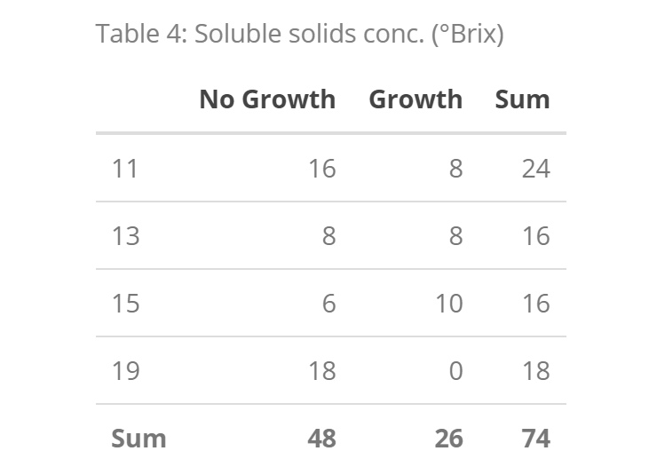
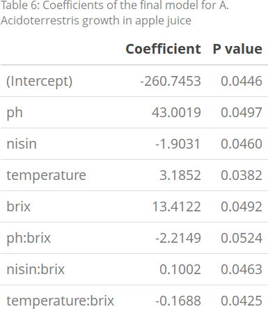

```{r setup, include=FALSE}
knitr::opts_chunk$set(fig.path='fig/', echo=FALSE, warning=FALSE, message=FALSE)
library(dplyr)
library(tidyr)
library(caret)
library(stats)
library(knitr)
library(kableExtra)
library(plotly)
```

```{r load_data}
features <- c("ph", "nisin", "temperature", "brix")
target <- "growth"
colnames <- c(features, c(target))
apple_juice <- read.table(
  "apple_juice.dat",
  header = FALSE,
  col.names = colnames,
)
factors <- c("No Growth", "Growth")
apple_juice$growth <- factor(
  apple_juice$growth,
  labels = factors
)

attach(apple_juice)
```

# Abstract

# Introduction
short intro / background, including a clear statement of the problem of interest

# Exploratory Data Analysis
complete exploratory data analysis

# Model fitting and selection
a description of your model fitting and selection analysis

# Model assessment
a description of your model assessment and justification / results of that

# Final model
your final chosen model written in mathematical terms; inclusion of relevant plots (they should be 'pretty')

# Conclusion
any conclusions adressing the problem of interest.
The frequency table of the `growth` response reveals that we have a semi-balanced dataset, with several more negative examples. Here, the response is categorical, so we are interested in proportions.

We are interested in finding true biologically
meaningful differences between sample types.

<!-- {width=48%} {width=4%} {width=48%}\ -->

<!-- {width=48%} {width=4%} {width=48%} -->

<!-- {width=50%}\ -->

<!-- {width=50%}\ -->

```{r}
lrt <- function(mod1, mod2) {
  anova(mod1, mod2, test="Chisq")
}

logreg <- function(rhs) {
  formula <- as.formula(paste("growth ~ ", rhs))
  # formulas <- append(formulas, formula)
  glm(formula, data=apple_juice, family=binomial())
}
```

```{r}
kable.var <- function(dt, caption) {
  dt %>%
    kable(caption = caption) %>%
    kable_styling(full_width = F) %>%
    row_spec(5, bold = T)
}

table.ph <- addmargins(table(ph, growth))
table.nisin <- addmargins(table(nisin, growth))
table.temperature <- addmargins(table(temperature, growth))
table.brix <- addmargins(table(brix, growth))

# kable.var(table.ph, "Table 1: pH")
# kable.var(table.nisin, "Table 2: Nisin concentration (IU/ml)")
# kable.var(table.temperature, "Table 3: Temperature (°C)")
# kable.var(table.brix, "Table 4: Soluble solids conc. (°Brix)")
```

```{r}
# All main and interaction effects
rhs.features <- paste("(", paste(features, collapse =" + "), ")^2")

# Model with all main and interaction effects
glm.full <- logreg(rhs.features)

# LRT
# drop1(glm.full, test="LRT")

# Final model
terms.dropped <- " -ph:nisin -ph:temperature - nisin:temperature"
glm.final <- logreg(paste(rhs.features, terms.dropped))
glm.final.summary <- summary.glm(glm.final)
# glm.final.summary
```

```{r}
coefs <- round(glm.final.summary$coefficients[,c(1, 4)], digits = 4)
caption <- "Table 5: Coefficients of the final model for A. Acidoterrestris growth in apple juice"

# coefs %>%
#     kable(caption = caption, col.names = c("Coefficient", "P value"), format = "html") %>%
#     kable_styling(full_width = F) %>%
#     save_kable("table5-uncropped.png")
```

```{r}
confusion.matrix <- function(m) {
  # type=response gives predicted probabilities
  model_prob <- predict(m, apple_juice, type="response")
  model_pred <- factor(1*(model_prob > .5), labels=factors)
  model_real <- factor(1*(growth == "Growth"), labels=factors)
  table(model_real, model_pred)
}

caption <- "Table 6: Confusion matrix summarizing results of applying the logistic regression model on the training data samples"
cm.table <- confusion.matrix(glm.final)
# cm.table %>%
#   kable(caption = caption, label = caption) %>%
#   kable_styling(full_width = F) %>%
#   add_header_above(c("Real label" = 1, "Predicted label" = 2))
```


```{r}
prob.grid.temp.brix <- function(ph.const, nisin.const) {
  dimrow <- max(temperature)
  dimcol <- max(brix)
  grid <- array(dim = c(dimrow, dimcol))
  for (row in 1:dimrow) {
    for (col in 1:dimcol) {
      newdata <- data.frame(ph=ph.const, nisin=nisin.const, temperature=row, brix=col)
      grid[row, col] = predict(glm.final, newdata, type="response")
    }
  }
  
  grid
}

prob.grid.nisin.brix <- function(ph.const, temp.const) {
  dimrow <- max(nisin)
  dimcol <- max(brix)
  grid <- array(dim = c(dimrow, dimcol))
  for (row in 1:dimrow) {
    for (col in 1:dimcol) {
      newdata <- data.frame(ph=ph.const, nisin=row, temperature=temp.const, brix=col)
      grid[row, col] = predict(glm.final, newdata, type="response")
    }
  }
  
  grid
}
```

```{r}
plot.surface <- function(data, title, xlabel, ylabel, minx, miny) {
  x <- minx:ncol(data)
  y <- miny:nrow(data)
  z <- data[y, x]
  default.font = list(size = 10)
  fig <- plot_ly(x=x, y=y, z=z, type="surface", colors="YlOrRd")
  fig <- fig %>% layout(
    font = default.font,
    title = list(
      text = title,
      font = list(size = 12)
    ),
    scene = list(
      xaxis = list(
        title = list(
          text = xlabel,
          font = default.font
        )
      ),
      yaxis = list(
        title = list(
          text = ylabel,
          font = default.font
        )
      ),
      zaxis = list(
        title = list(
          text = "growth probability",
          font = default.font
        )
      )
    ),
    height = 550
    # margin = list(l = 10, r = 10, b = 10, t = 10)
  )
  fig
}
```


```{r}
xlabel <- "soluble solids conc. (°Brix)"
ylabel <- "temperature (°C)"

g <- prob.grid.temp.brix(ph.const = 3.7, nisin.const = 0)

plot.surface(
  g,
  title = "Figure 1.a: Growth probability of CRA7152 in apple juice with nisin 0 IU/ml and pH = 3.7",
  xlabel,
  ylabel,
  minx = min(brix),
  miny = min(temperature)
)
```

```{r}
g <- prob.grid.temp.brix(ph.const = 4.5, nisin.const = 0)

plot.surface(
  g,
  title = "Figure 1.b: Growth probability of CRA7152 in apple juice with nisin 0 IU/ml and pH = 4.5",
  xlabel,
  ylabel,
  minx = min(brix),
  miny = min(temperature)
)
```

```{r}
xlabel <- "soluble solids conc. (°Brix)"
ylabel <- "nisin conc. (UI/ml)"

g <- prob.grid.nisin.brix(ph.const = 4.0, temp.const = 45)

plot.surface(
  g,
  title = "Figure 2.a: Growth probability of CRA7152 in apple juice with pH = 4.5 and temp. = 45°C",
  xlabel,
  ylabel,
  minx = min(brix),
  miny = min(nisin)
)
```

```{r}
g <- prob.grid.nisin.brix(ph.const = 4.0, temp.const = 30)

plot.surface(
  g,
  title = "Figure 2.b: Growth probability of CRA7152 in apple juice with pH = 4.5 and temp. = 30°C",
  xlabel,
  ylabel,
  minx = min(brix),
  miny = min(nisin)
)
```

